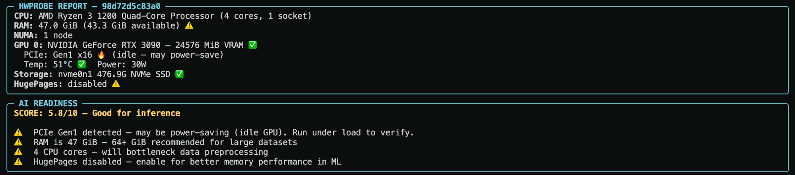

# hwprobe

Hardware profiling and AI readiness scoring for Linux workstations.



## What it does

hwprobe scans your machine and rates its readiness for ML/AI workloads on a 0-10 scale. It detects:

- **CPU** — model, core count, sockets, threads, max clock speed
- **GPU** — NVIDIA GPUs via `nvidia-smi` (VRAM, temperature, power draw)
- **PCIe** — link generation and width, with idle power-save detection
- **RAM** — total, available, swap usage
- **Storage** — NVMe/SSD/HDD classification via `lsblk`
- **NUMA** — node topology, per-node memory, GPU-to-node mapping
- **HugePages** — enabled/disabled status

The scoring engine weights GPU-related checks highest (VRAM and PCIe matter most for ML) and flags issues with actionable warnings.

## Installation

```bash
pip install rich typer
```

## Usage

```bash
# Full hardware report with AI readiness score
./hwprobe.py scan

# Individual subsystems
./hwprobe.py cpu
./hwprobe.py gpu
./hwprobe.py pcie
./hwprobe.py score

# JSON output (works with any subcommand, useful for piping)
./hwprobe.py scan --json
./hwprobe.py gpu --json
```

### Example: `scan`

```
┌ HWPROBE REPORT — my-workstation ─────────────────────┐
│ CPU: AMD Ryzen 3 1200 (4 cores, 1 socket)            │
│ RAM: 47.0 GiB (43.2 GiB available) ⚠️                │
│ NUMA: 1 node                                          │
│ GPU 0: RTX 3090 — 24576 MiB VRAM ✅                   │
│   PCIe: Gen1 x16 🔥 (idle — may power-save)           │
│   Temp: 51°C ✅  Power: 28W                            │
│ Storage: nvme0n1 476.9G NVMe SSD ✅                    │
│ HugePages: disabled ⚠️                                 │
├───────────────────────────────────────────────────────┤
│ SCORE: 5.8/10 — Good for inference                    │
│ ⚠️  PCIe Gen1 — verify under load                     │
│ ⚠️  47 GiB RAM — 64+ recommended                      │
│ ⚠️  4 CPU cores — bottleneck for preprocessing         │
│ ⚠️  HugePages disabled                                 │
└───────────────────────────────────────────────────────┘
```

### Example: `score --json`

```json
{
  "score": 5.8,
  "verdict": "Good for inference",
  "warnings": [
    "PCIe Gen1 detected — may be power-saving (idle GPU). Run under load to verify.",
    "RAM is 47 GiB — insufficient for most ML training",
    "4 CPU cores — will bottleneck data preprocessing",
    "HugePages disabled — enable for better memory performance in ML"
  ]
}
```

## Requirements

- Linux (reads `/proc/cpuinfo`, `/proc/meminfo`, `/sys/devices/system/node/`)
- Python 3.8+
- `rich` and `typer` (`pip install rich typer`)
- NVIDIA GPU + `nvidia-smi` (optional — gracefully handles missing GPUs)

## License

[MIT](../LICENSE)
